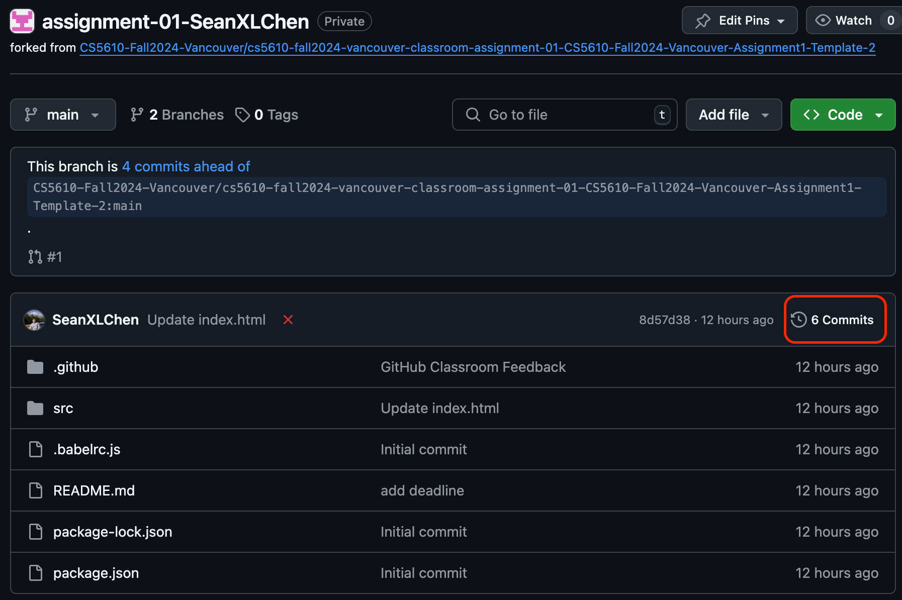

# Assignment 1: Personal Portfolio

Welcome to the Personal Portfolio Assignment! Your goal is to create a simple, static personal portfolio website using HTML and CSS. You will work within the `src` folder provided to you.

## Project Structure

Inside the `src` folder, you will find the following starting files:
```
  src/
  ├── index.html         # Your main landing page
  ├── css/
  │   └── style.css      # Your main CSS file, external styles should go here
  └── images/            # Store your images here (optional)
```

### Instructions

1. **Create Your Portfolio Pages**:
   - Begin by editing the `index.html` file. This will be your portfolio's landing page.
   - Create at least **2 additional HTML pages** (such as `about.html`, `projects.html`, etc.) that showcase your work experience, projects, education, hobbies, or other personal details.
   - Ensure that **all pages are connected via a navigation menu** with links to the other pages.
  

   Example:
   ```html
   <nav>
     <ul>
       <li><a href="./index.html">Home</a></li>
       <li><a href="./about.html">About</a></li>
       <li><a href="./projects.html">Projects</a></li>
     </ul>
   </nav>
   ```

2. **Design Your CSS Stylesheet**:

  - In the `src/css` folder, you will also find the `style.css` file. Use this file to define the styles for your HTML pages. You should apply consistent styling across all pages for headers, footers, navigation, and content sections.
  - Make sure to use proper CSS practices such as:
    - Use external styles (in the `style.css` file) rather than inline styles.
    - Utilize selectors, classes, and IDs appropriately.
    - Ensure your styles create a visually appealing and consistent layout across all pages.

## Assignment Requirements (Rubric)

##### Total Points: 100

For this assignment, you are expected to create a personal portfolio website. Below are the detailed requirements for both **HTML** and **CSS** components of your project, based on the rubric.

  Ensure that your files are organized as follows:
   ```
   src/
   ├── index.html         # Your main landing page
   ├── about.html         # Example: An about page (create your own additional pages)
   ├── projects.html      # Example: A projects page (create your own additional pages)
   ├── css/
   │   └── style.css      # Your main CSS file, external styles should go here
   └── images/            # Store your images here (optional)
   ```

1. **Proper File Structure & At least 3 HTML pages** (10 pt).
   - Your project must have a proper file structure:
     - CSS style should be defined in `style.css` within the `src/css` folder.
     - At least 3 HTML pages (include `index.html`) under the `src` folder. Suggested pages include: About Me, Projects, Work Experience, Education, Hobbies, etc.
     - Images should be placed in a subdirectory called `images` within the `src` folder.

2. **Title and Favicon** (5 pt).
   - All pages should have a title and a visible [favicon](https://developer.mozilla.org/en-US/docs/Learn/HTML/Introduction_to_HTML/The_head_metadata_in_HTML#adding_custom_icons_to_your_site) on the browser tab.

3. **Consistent Header** (5 pt).
   - A consistent header should span the full width on all pages.

4. **Navigation Menu** (10 pt).
   - A navigation menu should be present on all pages with links to other pages of your site.

5. **Footer** (10 pt).
   - A footer should be included on all pages with:
     - Copyright information.
     - Icons linked to your GitHub profile (social media icons are optional).
     - An icon that opens a new outgoing email message to your Northeastern email address.

6. **Image with Caption** (5 pt).
   - Add your image to your homepage with a [caption](https://developer.mozilla.org/en-US/docs/Web/HTML/Element/figure).

7. **Master's Course List** (5 pt).
   - Include a [list](https://developer.mozilla.org/en-US/docs/Web/API/HTMLInputElement/list) of all your Master's courses on a page with relevant content.

8. **Northeastern Logo** (5 pt).
   - Add a Northeastern logo image on a page and link it to the Northeastern website.

9. **External Styling** (5 pt).
   - Use external styling through the `style.css` file located in the `src/css` folder.

10. **Pseudo-Classes and Pseudo-Elements** (5 pt).
   - Include pseudo-classes (e.g., `:hover`, `:visited`) and pseudo-elements (e.g., `::before`, `::after`) in your CSS.

11. **Background Image** (5 pt).
   - Add a background image to at least one page.

12. **Text Area Width** (5 pt).
   - Make the visible text area **80% of the viewport's width**.

13. **Navigation Styling** (5 pt).
   - Give the navigation area a background color and make the text center-aligned.

14. **Visited Links Color** (5 pt).
   - Assign a custom color (different from the browser's default) to visited links.

15. **Google Fonts** (5 pt).
   - Use Google Fonts to enhance typography in your project.

16. **Anchor Links** (5 pt).
   - Include at least one anchor link (`<a>`) that links to a specific section within the same page using an `id`.

17. **Box-Sizing Behavior** (5 pt).
   - Adjust the box-sizing behavior so that the browser calculates an element’s total width and height, including its borders and padding.
   - Use **either Flexbox or Grid layout** in one or more sections for element positioning.

### Additional Notes

- You are encouraged to design a portfolio that you are proud to share with your friends.
- You may use icons from [FontAwesome](https://fontawesome.com/) to enhance your design.

### Automated Testing

Your project will be automatically tested against the rubric using a set of predefined tests. These tests will check the structure and content of your HTML and CSS files, so ensure your project strictly follows the guidelines provided. :warning: :warning: :warning: Any modification to files outside the `src` folder could result in failed tests or disqualification of your submission. :warning: :warning: :warning:

#### Viewing Your Autograder Score

To access the results of the autograder for your commits, follow these steps:

1. After pushing your changes to GitHub, click on the commit message to view the details of the specific commit.
   
2. On the commit details page, find the Actions status and click on it to view the results of the autograder task.
   
3. Review the detailed report of your autograded score. This report will show which tests passed or failed, and how many points were awarded based on the rubric.
   